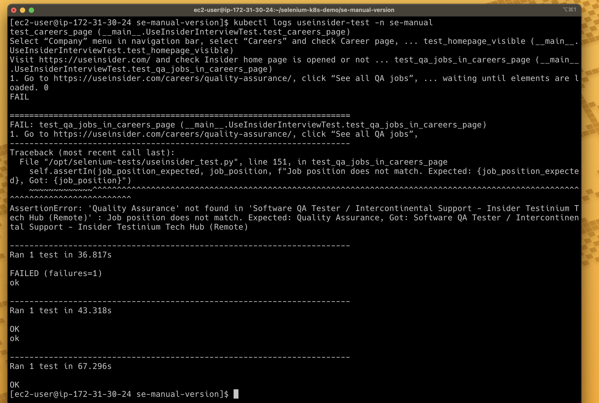
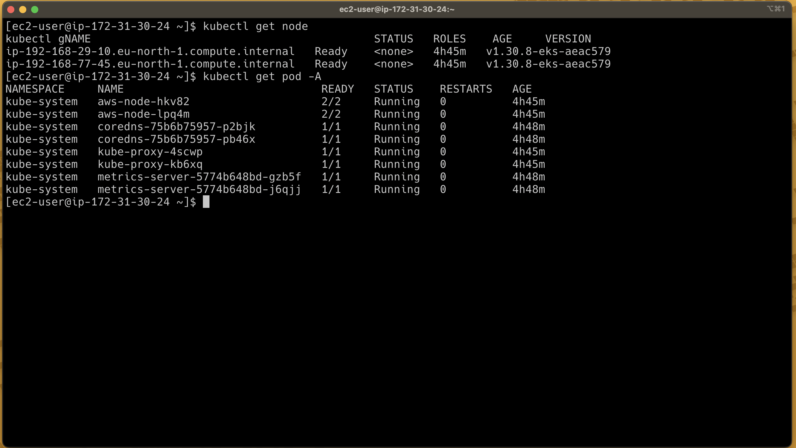
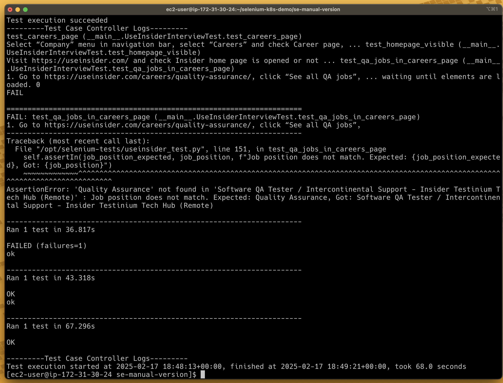
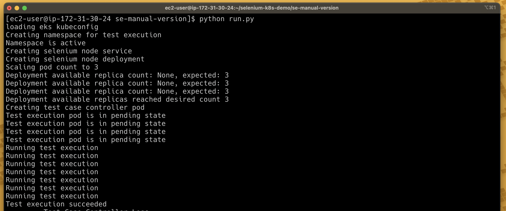
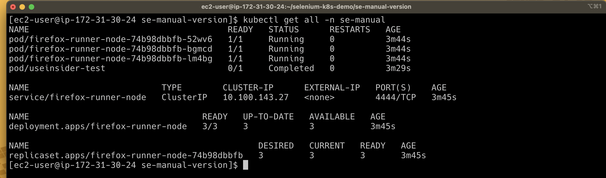

# Output

## EKS is ready

## Running tests

## Logs from pods. Note that 2 of tests was run by the same container(because how k8s internal loadbalancing works, we can't assure requests will be equally distributed)

